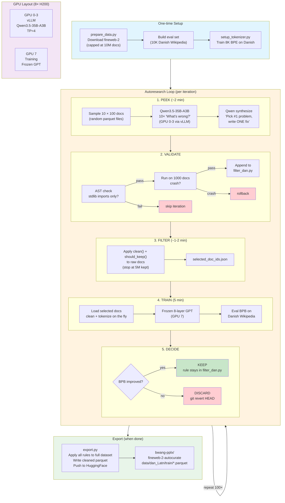
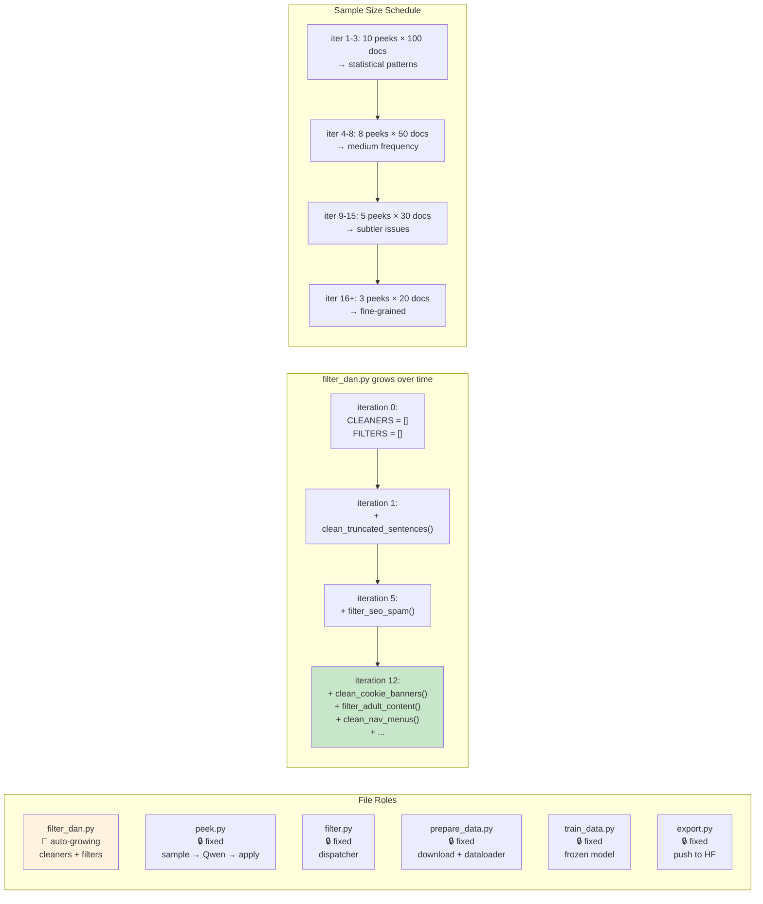

```mermaid
flowchart TB
    subgraph SETUP["One-time Setup"]
        DL["prepare_data.py<br/>Download fineweb-2<br/>(capped at 10M docs)"]
        EVAL["Build eval set<br/>(10K Danish Wikipedia)"]
        TOK["setup_tokenizer.py<br/>Train 8K BPE on Danish"]
        DL --> EVAL --> TOK
    end

    subgraph LOOP["Autoresearch Loop (per iteration)"]
        direction TB

        subgraph PEEK["1. PEEK (~2 min)"]
            SAMPLE["Sample 10 × 100 docs<br/>(random parquet files)"]
            QWEN_OBS["Qwen3.5-35B-A3B<br/>10× 'What's wrong?'<br/>(GPU 0-3 via vLLM)"]
            QWEN_SYN["Qwen synthesize<br/>'Pick #1 problem,<br/>write ONE fix'"]
            SAMPLE --> QWEN_OBS --> QWEN_SYN
        end

        subgraph VALIDATE["2. VALIDATE"]
            AST["AST check<br/>stdlib imports only?"]
            RUN["Run on 1000 docs<br/>crash?"]
            APPEND["Append to<br/>filter_dan.py"]
            AST -->|pass| RUN -->|pass| APPEND
            AST -->|fail| SKIP1["skip iteration"]
            RUN -->|crash| ROLLBACK["rollback"]
        end

        subgraph FILTER["3. FILTER (~1-2 min)"]
            APPLY["Apply clean() + should_keep()<br/>to raw docs<br/>(stop at 5M kept)"]
            IDS["selected_doc_ids.json"]
            APPLY --> IDS
        end

        subgraph TRAIN["4. TRAIN (5 min)"]
            LOAD["Load selected docs<br/>clean + tokenize on the fly"]
            MODEL["Frozen 8-layer GPT<br/>(GPU 7)"]
            BPB["Eval BPB on<br/>Danish Wikipedia"]
            LOAD --> MODEL --> BPB
        end

        subgraph DECIDE["5. DECIDE"]
            CMP{BPB improved?}
            KEEP["KEEP<br/>rule stays in filter_dan.py"]
            DISCARD["DISCARD<br/>git revert HEAD"]
            CMP -->|yes| KEEP
            CMP -->|no| DISCARD
        end

        PEEK --> VALIDATE --> FILTER --> TRAIN --> DECIDE
    end

    subgraph EXPORT["Export (when done)"]
        EXP["export.py<br/>Apply all rules to full dataset<br/>Write cleaned parquet<br/>Push to HuggingFace"]
        HF["bwang-pplx/<br/>fineweb-2-autocurate<br/>data/dan_Latn/train/*.parquet"]
        EXP --> HF
    end

    SETUP --> LOOP
    LOOP -->|"repeat 100×"| LOOP
    LOOP --> EXPORT

    subgraph GPU_LAYOUT["GPU Layout (8× H200)"]
        direction LR
        G03["GPU 0-3<br/>vLLM<br/>Qwen3.5-35B-A3B<br/>TP=4"]
        G7["GPU 7<br/>Training<br/>Frozen GPT"]
    end

    style SETUP fill:#e1f5fe
    style LOOP fill:#fff3e0
    style EXPORT fill:#e8f5e9
    style GPU_LAYOUT fill:#f3e5f5
    style KEEP fill:#c8e6c9
    style DISCARD fill:#ffcdd2
    style ROLLBACK fill:#ffcdd2
    style SKIP1 fill:#ffcdd2
```

```mermaid
flowchart LR
    subgraph FILES["File Roles"]
        direction TB
        F1["filter_dan.py<br/>🤖 auto-growing<br/>cleaners + filters"]
        F2["peek.py<br/>🔒 fixed<br/>sample → Qwen → apply"]
        F3["filter.py<br/>🔒 fixed<br/>dispatcher"]
        F4["prepare_data.py<br/>🔒 fixed<br/>download + dataloader"]
        F5["train_data.py<br/>🔒 fixed<br/>frozen model"]
        F6["export.py<br/>🔒 fixed<br/>push to HF"]
    end

    subgraph GROWTH["filter_dan.py grows over time"]
        direction TB
        I0["iteration 0:<br/>CLEANERS = []<br/>FILTERS = []"]
        I1["iteration 1:<br/>+ clean_truncated_sentences()"]
        I5["iteration 5:<br/>+ filter_seo_spam()"]
        I12["iteration 12:<br/>+ clean_cookie_banners()<br/>+ filter_adult_content()<br/>+ clean_nav_menus()<br/>+ ..."]
        I0 --> I1 --> I5 --> I12
    end

    subgraph SCHEDULE["Sample Size Schedule"]
        direction TB
        S1["iter 1-3: 10 peeks × 100 docs<br/>→ statistical patterns"]
        S2["iter 4-8: 8 peeks × 50 docs<br/>→ medium frequency"]
        S3["iter 9-15: 5 peeks × 30 docs<br/>→ subtler issues"]
        S4["iter 16+: 3 peeks × 20 docs<br/>→ fine-grained"]
        S1 --> S2 --> S3 --> S4
    end

    style F1 fill:#fff3e0
    style I12 fill:#c8e6c9
```
