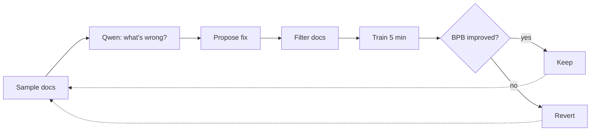

```mermaid
flowchart LR
    A["Sample docs"] --> B["Qwen: what's wrong?"]
    B --> C["Propose fix"]
    C --> D["Filter docs"]
    D --> E["Train 5 min"]
    E --> F{"BPB improved?"}
    F -->|yes| G["Keep"]
    F -->|no| H["Revert"]
    G & H -.-> A
```
