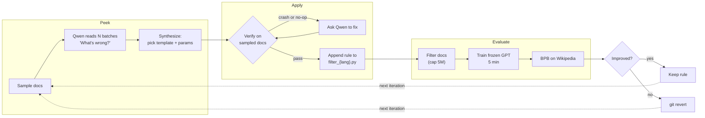

```mermaid
flowchart LR
    subgraph PEEK["Peek"]
        A["Sample docs"] --> B["Qwen reads N batches<br/>'What's wrong?'"]
        B --> C["Synthesize:<br/>pick template + params"]
    end

    subgraph APPLY["Apply"]
        C --> D{"Verify on<br/>sampled docs"}
        D -->|crash or no-op| E["Ask Qwen to fix"]
        E --> D
        D -->|pass| F["Append rule to<br/>filter_{lang}.py"]
    end

    subgraph EVAL["Evaluate"]
        F --> G["Filter docs<br/>(cap 5M)"]
        G --> H["Train frozen GPT<br/>5 min"]
        H --> I["BPB on Wikipedia"]
    end

    I --> J{Improved?}
    J -->|yes| K["Keep rule"]
    J -->|no| L["git revert"]
    K & L -.->|next iteration| A
```
