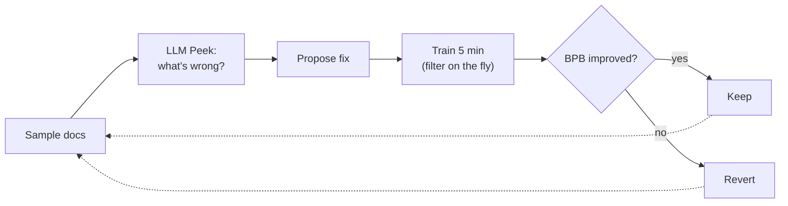

```mermaid
flowchart LR
    A["Sample docs"] --> B["LLM Peek:<br/>what's wrong?"]
    B --> C["Propose fix"]
    C --> D["Train 5 min<br/>(filter on the fly)"]
    D --> E{"BPB improved?"}
    E -->|yes| F["Keep"]
    E -->|no| G["Revert"]
    F & G -.-> A
```
