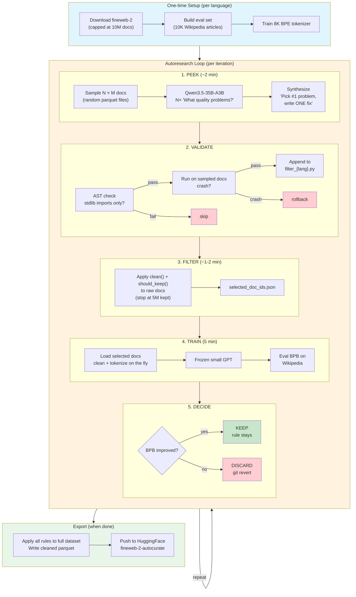

```mermaid
flowchart TB
    subgraph SETUP["One-time Setup (per language)"]
        DL["Download fineweb-2<br/>(capped at 10M docs)"]
        EVAL["Build eval set<br/>(10K Wikipedia articles)"]
        TOK["Train 8K BPE tokenizer"]
        DL --> EVAL --> TOK
    end

    subgraph LOOP["Autoresearch Loop (per iteration)"]
        direction TB

        subgraph PEEK["1. PEEK (~2 min)"]
            SAMPLE["Sample N × M docs<br/>(random parquet files)"]
            QWEN_OBS["Qwen3.5-35B-A3B<br/>N× 'What quality problems?'"]
            QWEN_SYN["Synthesize<br/>'Pick #1 problem,<br/>write ONE fix'"]
            SAMPLE --> QWEN_OBS --> QWEN_SYN
        end

        subgraph VALIDATE["2. VALIDATE"]
            AST["AST check<br/>stdlib imports only?"]
            RUN["Run on sampled docs<br/>crash?"]
            APPEND["Append to<br/>filter_{lang}.py"]
            AST -->|pass| RUN -->|pass| APPEND
            AST -->|fail| SKIP1["skip"]
            RUN -->|crash| ROLLBACK["rollback"]
        end

        subgraph FILTER["3. FILTER (~1-2 min)"]
            APPLY["Apply clean() + should_keep()<br/>to raw docs<br/>(stop at 5M kept)"]
            IDS["selected_doc_ids.json"]
            APPLY --> IDS
        end

        subgraph TRAIN["4. TRAIN (5 min)"]
            LOAD["Load selected docs<br/>clean + tokenize on the fly"]
            MODEL["Frozen small GPT"]
            BPB["Eval BPB on<br/>Wikipedia"]
            LOAD --> MODEL --> BPB
        end

        subgraph DECIDE["5. DECIDE"]
            CMP{BPB improved?}
            KEEP["KEEP<br/>rule stays"]
            DISCARD["DISCARD<br/>git revert"]
            CMP -->|yes| KEEP
            CMP -->|no| DISCARD
        end

        PEEK --> VALIDATE --> FILTER --> TRAIN --> DECIDE
    end

    subgraph EXPORT["Export (when done)"]
        EXP["Apply all rules to full dataset<br/>Write cleaned parquet"]
        HF["Push to HuggingFace<br/>fineweb-2-autocurate"]
        EXP --> HF
    end

    SETUP --> LOOP
    LOOP -->|repeat| LOOP
    LOOP --> EXPORT

    style SETUP fill:#e1f5fe
    style LOOP fill:#fff3e0
    style EXPORT fill:#e8f5e9
    style KEEP fill:#c8e6c9
    style DISCARD fill:#ffcdd2
    style ROLLBACK fill:#ffcdd2
    style SKIP1 fill:#ffcdd2
```
